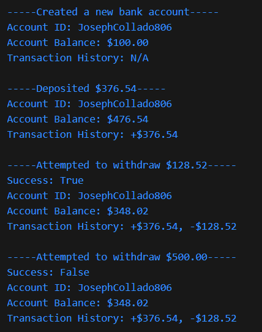

Joseph Collado  
Homework 4 Part 2 for CSC 350H @ BMCC

Assignment Instructions:  
2. Implement a class called BankAccount  
- Keeps track account id, balance, transactions, note: use properties to access these instance variables
- An account can be created given customer name, initial balance
- Create deposit and withdraw methods.
- Test the methods in the BankAccount class, considering all possible success and failure cases

Code Output:  

